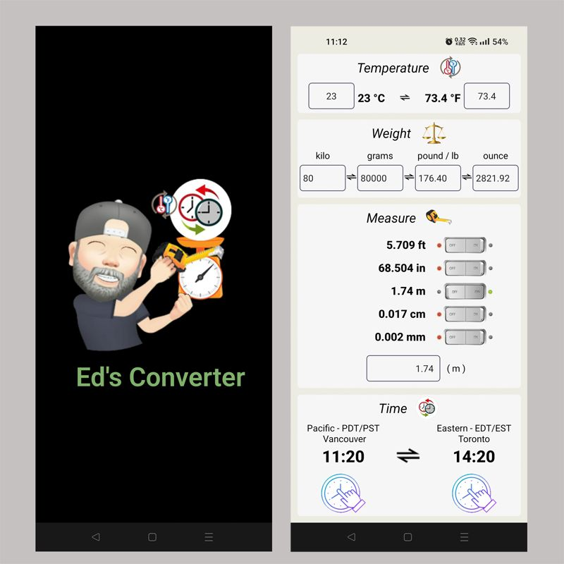

Just a project to keep the measures that i need in same page in a APP

<!--
expo updategit
link do video: https://www.youtube.com/watch?v=2ICOVstF6rU
tem que:
  eas login (logar)
    depois
  eas update --branch preview --message "UPADTE 280623"

This is to build a APK im EXPO
 ******* before start build has to change couple thinks

eas build -p android --profile preview
